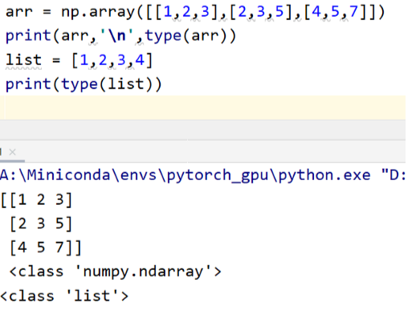
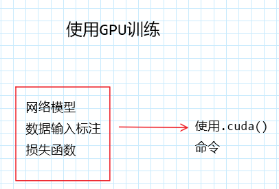
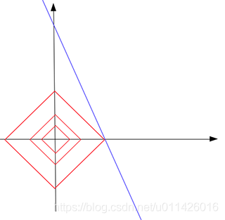

# 深度学习

# pytorch

## anaconda

1.创建虚拟环境

```
conda create -n pytorch python=3.7
```

2.删除

```
conda remove -n pytorch -all
```

## pytorch安装

1. 笑死，使用conda竟然跟我说找不到？？

2. 用pip安装，不用挂梯子，用pytorch原网站安装，带宽跑满了好吧？！狗吧conda

## numpy基础（一）

**1.1**

```python
A = np.array()
B = np.array()

    (1)A*B  等价于  np.multipy(A,B)
即对应位置相乘
    (2)推广：激活函数
x = np.random.rand(2,3)  # x的形状
def softmoid(x):
    return 1/(1+np.exp(-x))
def relu(x):
    return np.maxinum(0,x)
def softmax(x):
    return np.exp(x)/np.sum(np.exp(x))
```

**1.2 点积**

即为矩阵相乘

语法：result = np.dot(a,b)

**1.3 格式**

```python
import torch
import numpy as np
import cv2
img=cv2.imread('1.jpeg')
print(type(img))
输出的图片格式为 array格式
```

**列表与ndarry格式：**



**2 数组变形**

```python
arr.reshape()
改变维度
```

```python
arr.resize()
改变维度，改变向量自身
```

```python
arr.travel
对向量进行展平，不会产生原数组的副本
```

```python
arr.flatten
展平，产生副本
```

```python
arr.squeeze
 对维数为1的维度进行降维。对多维数组使用时无作用
```

```python
arr.transpose 
对高位矩阵进行轴对换
```

**3 数组合并**

```python
np.append
np.concatenate
np.stack
np.hstack
np.vstack
np.dstack
np.vsplit
```

（1）说明：append，concatenate，stack都有axis参数，用于控制数组的合并方式时按行还是按列

（2）对于append和concatenate，待合并的数组必须由相同的行数或列数

（3）stack，hstack，dstack 要求待合并的数组必须具有相同的形状

**4 批量操作**

```python
'''
批量处理
'''
data_train=np.random.randn(10000,2,3)
print(data_train.shape)
np.random.shuffle(data_train)
batch_size=100
foriinrange(0,len(data_train),batch_size):
    x=np.sum(data_train[i:i+batch_size])
print("batch{},sum{}".format(i,x))
```

## Numpy基础（二）


b是一个位置型数组，每一个值是bool型的，b中为1的位置将a中对应位置修改为指定值

## tensor

1. 概述

2. ndarray 转换为 Tensor

```python
a = np.array()

a1 = torch.from_numpy(a)
```

3. 逐元素操作

```python
abs/add

addcdiv

sigmoid/tanh/softmax
```

## 损失函数

**1. 交叉熵损失**

nn.cross_entropy()

该损失函数已经将softmax，sigmoid，传统交叉熵集成，因此训练时只需要将神经元输出直接放入即可

## 数据

1. 数据增强方法
   
   如flip、rotate、random、move & crop、GAN


2. 数据集

```python
from torch.utils.data import DataLoader
// DataLoader方便batchsize操作


from torch.utils.data import Dataset


class dataset(Dataset):

    def __init__(self):
        super
```

## 训练

```python
device = torch.device('cuda')


model = model().to(device)

criten = nn.CrossEntropyLoss().to(device)

optimizer = optim.Adam(model.parameters, lr = 1e-3)


for epoch in range(epoches):

    model.train()

    for batch_id,(x,label) in enumuerate (train):

        x,label=x.to(device), label.to(device)

        logits = model(x)  //调用forward函数

        loss = criten(logits, label)  // Tensor Scale

        optimizer.zero_grad() //优化器梯度归零，防止梯度累加
        loss.backward()  //反向传播
        optimizer.step() 
         //优化器优化，对优化器参数 model.Parameters()即模型参数优化，使模型收敛

    model.eval()
    with torch.no_grad():
        for x,label in data_test:
...
```

**使用GPU:**

```python
device = torch.device("cuda")
module.to(device)
input.to(device)
target.to(device)
loss_func.to(device)
```



## 蒙特卡洛链MCMC


## 稀疏正则化

**正则化方法：**

L0范数是指向量中非0的元素的个数。(L0范数很难优化求解)

L1范数是指向量中各个元素绝对值之和

L2范数是指向量各元素的平方和然后求平方根

**为什么在loss函数中增加l1范数会给出稀疏解？**



l1范数是红色的（表征各个绝对值之和），蓝色线表示要拟合的线，在loss包含l1范数时，红色的线会逼近蓝色的线，从而在坐标轴上产生**稀疏解**，如[1000,0.5]这种

## latent space

- 隐空间只是一种压缩数据的表示，其中相似的数据点在空间上更接近。
- 隐空间对于学习数据特征、寻找更简单的数据表征从而进行分析很有帮助。
- 我们可以通过分析隐空间中的数据来了解数据点之间的模式或结构相似性，无论是通过流形（manifolds）还是聚类等方式。
- 我们可以在隐空间中插值数据，并使用我们模型的解码器来“生成”数据样本。
- 我们可以使用t-SNE和LLE等算法将隐空间可视化，这些算法将我们的隐空间表征转化为二维或三维。
