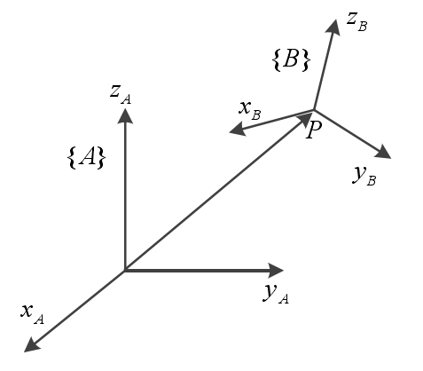
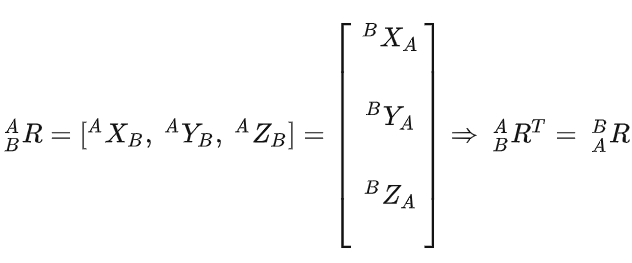

# 点云

## 显示点云

```cpp
#include <iostream>
#include <pcl/io/pcd_io.h>
#include <pcl/io/ply_io.h>
#include <pcl/point_types.h>
#include <pcl/filters/filter_indices.h>
#include <pcl/point_cloud.h>
#include <pcl/visualization/pcl_visualizer.h>
#include <boost/thread/thread.hpp>
#include <pcl/features/moment_of_inertia_estimation.h>


    boost::shared_ptr< pcl::visualization::PCLVisualizer > viewer(new pcl::visualization::PCLVisualizer("Ransac"));
    viewer->addCoordinateSystem(5.0);
    viewer->initCameraParameters();
    viewer->setBackgroundColor(0, 0, 0);
    viewer->addPointCloud(cloud, "cloud");
    viewer->spin();
```


## 变换

对于空间中的一个点可以用位置矢量描述，但是对于空间中的一个物体，仅仅使用位置描述显然是不够的，所以还需要引入姿态描述。如图3.2所示，为了描述物体的姿态，我们通过在物体上固定一个坐标系 B，那么可以用坐标系 B 相对于坐标系 A 的关系可以描述物体的姿态。

一般用下面的来描述：(A表示参考坐标系，而B表示物体坐标系)
$$
^{A}_{B}R=
\left[
\begin{matrix}
^{A}X_B,^{A}Y_B,^{A}Z_B
\end{matrix}
\right]
$$


该式满足：



**复合变换：**
$$
^AP=^{A}_{B}P^{B}P+^AP_{BOPG}
$$


**欧拉角：**（欧拉角是基于物体本身的坐标系进行变换的，基于物体本身的坐标系进行变换需要右乘） ，如下图所示：


该图表示了（z,x,z'）的变换过程，那么变换矩阵就是：


```cpp
 Eigen::Matrix4f transform_1 = Eigen::Matrix4f::Identity();
        float theta = M_PI/4;   //旋转的度数，这里是45度
        transform_1 (0,0) = cos (theta);  //这里是绕的Z轴旋转
        transform_1 (0,1) = -sin(theta);
        transform_1 (1,0) = sin (theta);
        transform_1 (1,1) = cos (theta);
        //   transform_1 (0,2) = 0.3;   //这样会产生缩放效果
        //   transform_1 (1,2) = 0.6;
        //    transform_1 (2,2) = 1;
        transform_1 (0,3) = 25; //这里沿X轴平移
        transform_1 (1,3) = 30;
        transform_1 (2,3) = 380;
        pcl::PointCloud<pcl::PointXYZ>::Ptr transform_cloud1 (new pcl::PointCloud<pcl::PointXYZ>);
        pcl::transformPointCloud(*cloud,*transform_cloud1,transform_1);  //不言而喻
        
        //局部
        pcl::transformPointCloud(*cloud,pcl::PointIndices indices,*transform_cloud1,matrix); //第一个参数为输入，第二个参数为输入点云中部分点集索引，第三个为存储对象，第四个是变换矩阵。
```


## 极值

```
pcl::getMinMax3D()
```

## 

## 点云增加点

增加点有两种方法。

1.直接把对应序号的点的xyz点复制到对应点云,但是这种方法会增加点云的索引，事实上用不到这么多索引，如果后续需要索引点云的，这种方法会导致点不是连续的

```cpp
newpointcloud->points[i].x = oldpointcloud[i].x
```

2.直接增加

```
#include <pcl/io/pcd_io.h>
#include <pcl/common/impl/io.hpp>
#include <pcl/point_types.h>
#include <pcl/point_cloud.h>
 
pcl::PointCloud<pcl::PointXYZ>::Ptr cloud(new pcl::PointCloud<pcl::PointXYZ>);
pcl::io::loadPCDFile<pcl::PointXYZ>("C:\office3-after21111.pcd", *cloud);
pcl::PointCloud<pcl::PointXYZ>::iterator index = cloud->begin();
cloud->erase(index);//删除第一个
index = cloud->begin() + 5;
cloud->erase(cloud->begin());//删除第5个
pcl::PointXYZ point = { 1, 1, 1 };
//在索引号为5的位置1上插入一点，原来的点后移一位
cloud->insert(cloud->begin() + 5, point);
cloud->push_back(point);//从点云最后面插入一点
std::cout << cloud->points[5].x;//输出1
```


## io

保存ply文件：

```
pcl::io::savePLYFile("../tmp.ply", triangles);
```

保存obj文件：

```
pcl::io::saveOBJFile("../tmp.obj", triangles);
```

保存pcd文件：

```
pcl::io::savePCDFileASCII("../file/t.pcd", *cloud_);
```

